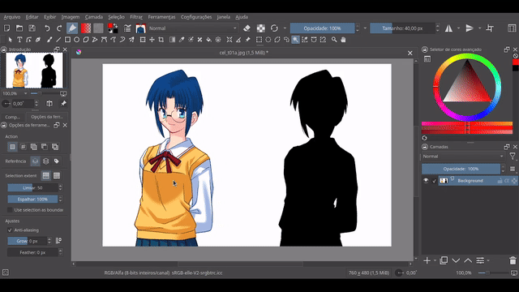

A krita python script that uses the contiguous (magic wand) select tool for automatically extracting NScripter character sprites.

### Demo

### How to use
1. Go to Tools > Scripts > Ten Scripts
2. Click on ... button
3. Select the sprite_extract file
4. Click Ok

In order to change the binding to a different key, you need to go to:

1. Click on Settings > Configure Krita...
2. Go to Keyboard Shortcuts
3. Locate Ten scripts and change the Execute Script (the number you selected the script file) to the keybind you want.
